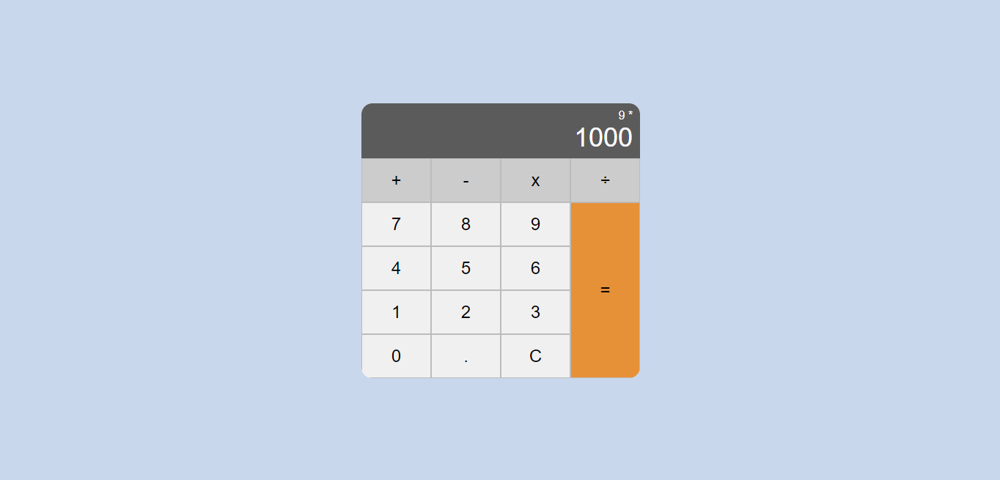

<p align="center">
  
</p>

# A simple calculator

This project offer a calculator in JavaScript that performs basic arithmetic operations (addition, subtraction, multiplication, division) without using 'eval'.

## Resources 🚀

- **Basic Arithmetic Operations:** addition, subtraction, multiplication and division.
- **Friendly user interface:** simple and intuitive design.

## How to use 🧮

1. **Clone repository:**
   ```bash
   git clone https://github.com/kiteyz/simple-calculator.git
    ```
   
2. **Open HTML file:**
Open the `index.html` file in your browser.

3. **All ready!**
Try different arithmetic operations and discover how easy it is to use the calculator.

## License 📝

This project is licensed under the MIT License, guaranteeing freedom to use, modify and distribute according to your needs.
